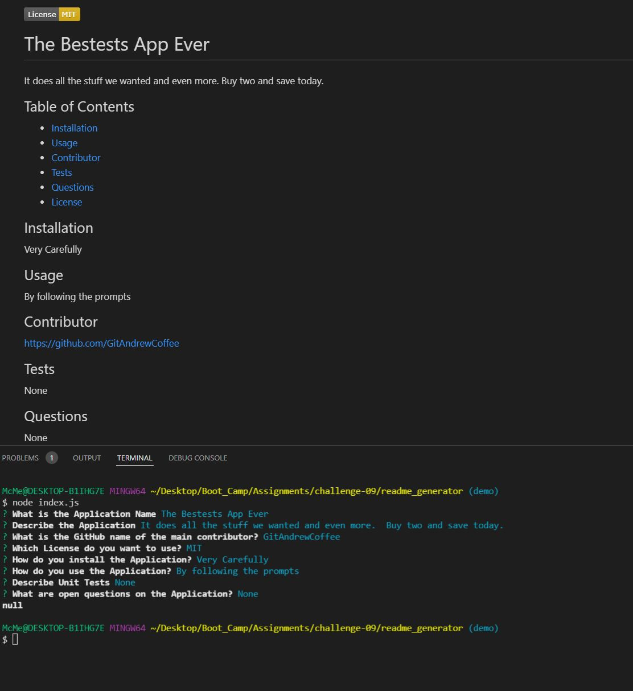

  

  # readme_generator

  This application will generate a readme.md file using markdown.

  ## Table of Contents

  - [Installation](#Installation)  
  - [Usage](#Usage) 
  - [Contributor](#Contributor)  
  - [Tests](#Tests)  
  - [Questions](#Questions)  
  - [License](#License)  

  ## Installation

  To install this application you will need to down load the application and run NPM install.

  ## Usage

  Simply follow the prompts

  See Video

  

  ## Contributor

  https://github.com/GitAndrewCoffee

  Using:

  - JavaScript
  - Node
  - NPM
  - NPM FS
  - NPM Inquirer
  
  ## Tests

  There are no unit tests for this application.

  ## Questions

  No Open Questions
  
  ## License

  Please visit this link for license details: https://opensource.org/licenses/MIT
